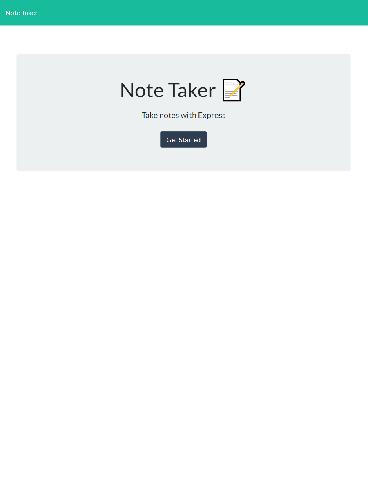

# Note Taker: Express.js, Node.js & Heroku

## About

This Note Taker App is Hosted by Heroku.  It allows the user to store, retrieve and delete personal notes. Overall this project was a fun one, learning about routing in Express.js, and glueing everything together makes for a very fullfilling Homework assignment. Looking forward to applying these skills to a larger product!

[Try It Out!](https://my-heroku-app-note-taker5000.herokuapp.com/)

## Resources

- Heroku
- Express.js
- Node.js
- UCSD Full-Stack Bootcamp

## Usage

